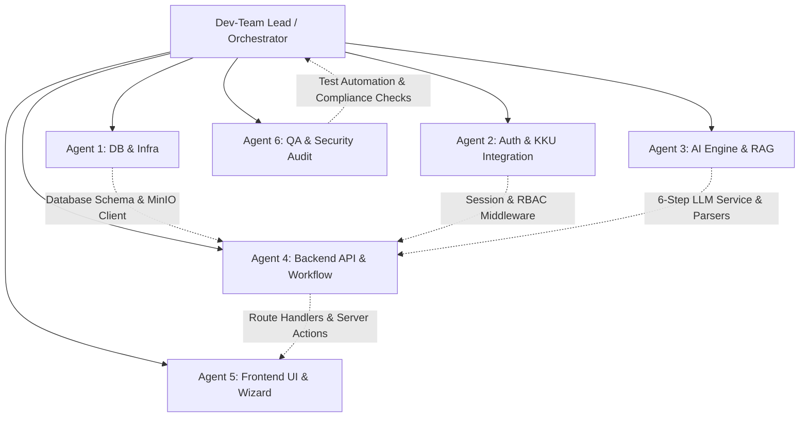

# AGENTS.md — SpecWise AI Dev-Team Multi-Agent Architecture & Orchestration

> **Project**: SpecWise AI (AI Intelligent Asset Budget & Specification Assistant - KKU AI Hackathon 2026)  
> **Architecture Baseline**: Next.js 15+ (App Router, TypeScript) + Prisma ORM + PostgreSQL (`pgvector`) + MinIO S3 + Tailwind CSS + KKU SSONext (OIDC) / Google Workspace + KKU IntelSphere (OpenAI-compatible LLM endpoint).

---

## 1. System Vision & Dev-Team Operating Model

SpecWise AI is an enterprise-grade AI assistant designed to revolutionize the government/university asset budgeting process (ครุภัณฑ์) for Khon Kaen University. It transforms the legacy workflow from:
$$\text{“คนคิด} \rightarrow \text{คนค้น} \rightarrow \text{คนตรวจ} \rightarrow \text{คนแก้} \rightarrow \text{คนเขียน} \rightarrow \text{คนตรวจซ้ำ”}$$
into an evidence-based, AI-augmented workflow:
$$\text{“AI วิเคราะห์} \rightarrow \text{AI ตรวจ} \rightarrow \text{AI แนะนำ} \rightarrow \text{AI ร่าง} \rightarrow \text{คนอนุมัติ”}$$

To ensure rapid, clean, and parallel development, the engineering team operates as a **Multi-Agent Dev-Team**. Each agent has a specialized domain, strict file ownership, and predefined contracts.

---

## 2. Dev-Team Agent Roster & Responsibilities

### 👑 Dev-Team Lead / Orchestrator Agent
- **Role**: Technical Lead & System Architect.
- **Responsibilities**:
  - Break down features into non-conflicting tasks for Sub-Agents.
  - Enforce `.agents/FILE_OWNERSHIP.md` boundaries before any work starts.
  - Review code output from Sub-Agents for architectural consistency, security, and type-safety.
  - Ensure zero regressions and resolve cross-domain integration blockers.

---

### 💾 Agent 1: Database, Storage & Infrastructure (`agent-db-infra`)
- **Domain**: Docker Compose, PostgreSQL with `pgvector`, Prisma Schema & Migrations, MinIO S3 Bucket Setup.
- **Key Deliverables**:
  - `docker-compose.yml`: Multi-container setup (PostgreSQL, MinIO, Next.js).
  - `prisma/schema.prisma`: Data models for Users, BudgetRequests, Items, StandardCatalogs, Quotations, Attachments, and AuditLogs.
  - `src/lib/db/prisma.ts`: Singleton Prisma client with connection pooling.
  - `src/lib/storage/minio.ts`: S3-compatible client for uploading, streaming, and generating presigned URLs for PDF and image attachments.
  - Seed scripts for standard equipment catalogues (สำนักงบประมาณ 2569, กระทรวง DE 2569, บัญชี มข.).

---

### 🔐 Agent 2: Authentication & KKU Integrations (`agent-auth-kku`)
- **Domain**: KKU SSONext (OAuth2/OIDC), Google Workspace OAuth, Session Management, RBAC.
- **Key Deliverables**:
  - `src/lib/auth/`: NextAuth.js / Auth.js configuration with KKU SSONext OIDC Provider & Google Provider.
  - `src/lib/kku/employee-api.ts`: Client for KKU Employee API v3 (fetching user faculty, department, position, and budget rights).
  - `src/lib/auth/mock-auth.ts`: High-fidelity mock adapter for offline local development.
  - `src/middleware.ts`: Route protection and role verification (Requester, Dept Verifier, Approver, Admin).

---

### 🧠 Agent 3: AI Engine & RAG Specialist (`agent-ai-engine`)
- **Domain**: KKU IntelSphere (OpenAI-compatible) Integration, 6-Step Budget & Spec AI Pipelines, RAG Matcher.
- **Key Deliverables**:
  - `src/lib/ai/intelsphere-client.ts`: OpenAI SDK instance configured for KKU IntelSphere endpoints (`KKU_INTELSPHERE_API_KEY`, `KKU_INTELSPHERE_BASE_URL`, `KKU_INTELSPHERE_MODEL`).
  - `src/lib/ai/prompts/`: Structured Prompt Engineering for all 6 Steps:
    - **Step 1**: Intent & Quantity Parser (`parse-intent.ts`).
    - **Step 2**: Standard Name Matcher with Evidence Citations (`match-standard-name.ts`).
    - **Step 3**: 4-Source Price Cross-Checker (`cross-check-prices.ts`).
    - **Step 4**: Budget Reasonableness & Procurement Alert Evaluator (`evaluate-budget-alert.ts`).
    - **Step 5**: 8-Section Budget Request Form Draft Generator (`generate-budget-form.ts`).
    - **Step 6**: Neutral, Non-Brand-Locking Technical Spec Generator (`generate-neutral-spec.ts`).
  - `src/lib/ai/parsers.ts`: Zod schema validation for structured LLM JSON outputs.

---

### ⚙️ Agent 4: Backend API & Workflow Engine (`agent-backend-api`)
- **Domain**: Next.js Server Actions, Route Handlers, Workflow State Machine, PDF Generation.
- **Key Deliverables**:
  - `src/app/api/requests/`: REST & Server Action endpoints for CRUD operations on budget requests.
  - `src/app/api/ai/`: API endpoints connecting Frontend Wizard to Agent 3's AI services.
  - `src/lib/workflow/state-machine.ts`: Transitions between `DRAFT`, `AI_ANALYZED`, `DEPT_REVIEW`, `SUBMITTED`, `REVISED`, `APPROVED`.
  - `src/lib/pdf/generator.ts`: Generate standardized PDF budget submission forms matching official KKU templates.

---

### 🎨 Agent 5: Frontend UI/UX & Wizard (`agent-frontend-ui`)
- **Domain**: Next.js App Router Pages, Tailwind CSS Design System, Interactive 6-Step Wizard, Real-time Dashboard.
- **Key Deliverables**:
  - `src/components/wizard/`: Interactive multi-step form for Steps 1 through 6 with real-time AI suggestions, diff viewers, and confirmation modals.
  - `src/components/dashboard/`: Executive analytics (VA/NVA metrics, budget breakdown, submission status charts).
  - `src/components/evidence/`: Price cross-check comparison table showing 4 sources with direct page/item citations.
  - `src/components/spec/`: Neutral specification editor with category breakdowns and brand-locking warnings.
  - `src/components/common/`: Toast notifications, file dropzones (single merged PDF validator), loading skeletons.

---

### 🛡️ Agent 6: QA, Compliance & Security Audit (`agent-qa-security`)
- **Domain**: Testing, Mock Fixtures, Security Hardening, Procurement Rule Compliance.
- **Key Deliverables**:
  - `tests/unit/`: Unit tests for AI parsers, budget calculators, and validation logic.
  - `tests/integration/`: End-to-end API tests mocking KKU SSONext, MinIO, and KKU IntelSphere.
  - `tests/fixtures/`: Realistic sample datasets (e.g., Data Science Workstation, 3 quotations PDF, ICT price catalogue).
  - `src/lib/security/anti-prompt-injection.ts`: Input sanitizers preventing prompt injection or budget manipulation.
  - `src/lib/security/procurement-linter.ts`: Automated check to detect commercial brand names in generated specifications.

---

## 3. Parallel Execution Protocol & Safety Rules

1. **Strict File Isolation**: Agents must ONLY create or edit files in their designated directories as specified in [.agents/FILE_OWNERSHIP.md](file:///.agents/FILE_OWNERSHIP.md).
2. **Interface First**: Before writing logic, agents must publish TypeScript types in shared contract interfaces (`src/types/`).
3. **No Direct Overwriting of Shared Configs**: Only the Orchestrator / Lead can modify `package.json`, `tsconfig.json`, `next.config.mjs`, or root configuration files.
4. **Mock Before Integration**: Every external dependency (MinIO, KKU SSONext, KKU IntelSphere) must have a clean mock interface for instant local testing.
5. **Thai Language & Procurement Precision**: All user-facing terms, error messages, and AI-generated budget drafts must adhere to official Thai public procurement terminology (พัสดุ / งบลงทุน / ครุภัณฑ์ / ราคากลาง).
