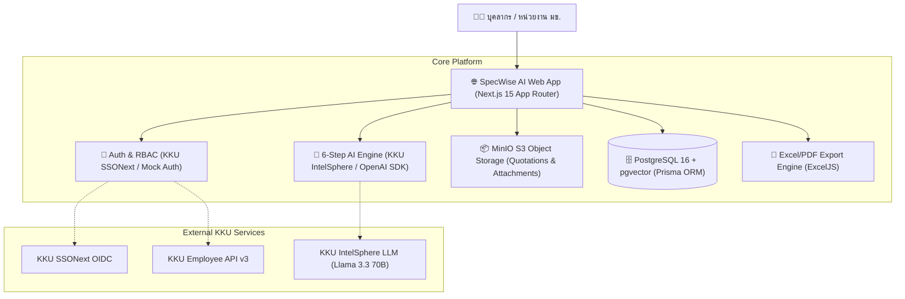

# SpecWise AI 🧠✨
### AI-Powered Intelligent Asset Budget & Specification Assistant
**Khon Kaen University AI Hackathon 2026**

[](https://nextjs.org/)
[](https://www.typescriptlang.org/)
[](https://www.prisma.io/)
[](https://github.com/pgvector/pgvector)
[](https://min.io/)
[](https://tailwindcss.com/)
[](https://vitest.dev/)

---

## 📖 Executive Summary & Vision

**SpecWise AI** is an enterprise-grade AI system engineered to modernize and accelerate the government and university asset procurement budgeting process (คำของบประมาณจัดหารายการครุภัณฑ์) for **Khon Kaen University (KKU)**.

Traditional public procurement processes suffer from high friction and administrative overhead:
$$\text{“คนคิด} \rightarrow \text{คนค้น} \rightarrow \text{คนตรวจ} \rightarrow \text{คนแก้} \rightarrow \text{คนเขียน} \rightarrow \text{คนตรวจซ้ำ”}$$

**SpecWise AI** transforms this into an evidence-based, AI-augmented workflow:
$$\text{“AI วิเคราะห์} \rightarrow \text{AI ตรวจ} \rightarrow \text{AI แนะนำ} \rightarrow \text{AI ร่าง} \rightarrow \text{คนอนุมัติ”}$$

---

## 📚 คู่มือการใช้งานระบบ (System Manuals)

- 📘 **[คู่มือการใช้งานสำหรับผู้ใช้งานทั่วไป (User Manual)](docs/USER_MANUAL.md)**: คำแนะนำทีละขั้นตอนพร้อมภาพประกอบ สำหรับอาจารย์ นักวิจัย และผู้ขอตั้งงบประมาณ
- 🛠️ **[คู่มือสำหรับผู้ดูแลระบบและเจ้าหน้าที่พัสดุ (Admin Manual)](docs/ADMIN_MANUAL.md)**: คู่มือการใช้งาน Admin Control Center, ระบบคิวตรวจสอบความเสี่ยง, การซิงค์แคตตาล็อก และการกำกับดูแล
- 📂 **[ศูนย์รวมเอกสารทั้งหมด (Documentation Hub)](docs/README.md)**

---

## 🚀 Key Capabilities & The 6-Step AI Engine


1. **Step 1: Smart Intent & Quantity Parsing**
   - Natural language extraction of requested equipment, purpose, user capacity, and target quantities.
2. **Step 2: Standard Catalog Matcher & Classification**
   - Automated semantic search and alignment against official catalogs:
     - 🏛️ บัญชีราคามาตรฐานครุภัณฑ์ สำนักงบประมาณ (ฉบับปีงบประมาณ 2569)
     - 💻 เกณฑ์ราคากลางและคุณลักษณะพื้นฐาน ICT กระทรวงดิจิทัลเพื่อเศรษฐกิจและสังคม (DE 2569)
     - 🎓 บัญชีราคามาตรฐานครุภัณฑ์ มหาวิทยาลัยขอนแก่น
3. **Step 3: 4-Source Price Cross-Checker**
   - Cross-verifies requested prices across: (1) Standard Catalog, (2) Historical University Procurement, (3) Market Reference Prices, and (4) Uploaded Vendor Quotations with direct page/item citations.
4. **Step 4: Reasonableness & Procurement Alert Evaluator**
   - Automatic detection of procurement red flags, budget inflation, over-specification, and commercial brand-locking.
5. **Step 5: 8-Section Official Request Form Draft Generator**
   - Auto-generates fully drafted justification documents adhering to KKU's official 8-section budget proposal framework.
6. **Step 6: Neutral Technical Specification (TOR) Generator**
   - Generates non-brand-locking, transparent, and legally compliant technical specifications ready for bidding.
7. **📊 Real-Time Executive Dashboard & Value-Added (VA/NVA) Metrics**
   - Live analytics for budget allocation, cycle time reduction, standard catalog adherence rate, and process efficiency.
8. **📑 Official Excel & PDF Export Engine**
   - Generates standard `.xlsx` (matching KKU `sample_requestform` template) and print-ready summary documents.

---

## 🏗️ System Architecture



---

## 🛠️ Technology Stack

| Layer | Technology | Description |
| :--- | :--- | :--- |
| **Framework** | Next.js 15.1 (App Router) + React 19 | High-performance full-stack web application |
| **Language** | TypeScript 5.7 | Strict end-to-end type safety |
| **Styling** | Tailwind CSS 3.4 + Lucide Icons | Clean modern UI tailored for enterprise workflows |
| **Database** | PostgreSQL 16 with `pgvector` | Relational data store & vector embeddings |
| **ORM** | Prisma ORM 6.4 | Type-safe queries, schema migrations, and relational models |
| **Object Storage** | MinIO S3 (Docker) | S3-compatible storage for quotations and documents |
| **AI / LLM** | KKU IntelSphere (`llama-3.3-70b-instruct`) / OpenAI SDK | Structured 6-step prompt orchestration & Zod schema parsing |
| **Data Export** | ExcelJS + Custom Template Mapper | Pixel-perfect Excel generation matching KKU templates |
| **Testing** | Vitest 3.0 | Fast unit & integration test runner |

---

## 🚦 Getting Started

### 1. Prerequisites
- **Node.js**: `v20.x` or `v22.x`
- **Docker & Docker Compose** (for PostgreSQL and MinIO)
- **Git**

### 2. Clone Repository & Install Dependencies
```bash
git clone https://github.com/sckku/SpecWiseAI.git
cd SpecWiseAI

# Install packages
npm install
```

### 3. Environment Configuration
Copy the sample environment variables:
```bash
cp .env.example .env.local
```
> **Tip**: Out of the box, `ENABLE_MOCK_AUTH=true`, `ENABLE_MOCK_AI=true`, and `ENABLE_MOCK_STORAGE=true` allow full end-to-end offline testing without requiring live external KKU API credentials.

### 4. Start Infrastructure Containers
Launch PostgreSQL (`pgvector`) and MinIO:
```bash
docker compose up -d
```

### 5. Setup Database & Seed Standard Catalogs
Initialize database schema and seed official 2569 procurement catalogs:
```bash
npm run db:push
npm run db:seed
```

### 6. Start the Development Server
```bash
npm run dev
```
Open [http://localhost:3000](http://localhost:3000) in your browser.

---

## 🧪 Testing & Validation

Run the automated test suite covering AI parsers, budget calculators, procurement rules, and Excel export engines:
```bash
npm test
```

---

## 📂 Project Structure

```
specwise-ai/
├── src/
│   ├── app/                    # Next.js App Router (Pages & API Route Handlers)
│   │   ├── admin/              # Administrative & System Configuration
│   │   ├── api/                # API Endpoints (Requests, AI, Export, Catalogs)
│   │   ├── catalogs/           # Standard Procurement Catalogs Explorer
│   │   ├── notifications/      # System & Approval Notifications
│   │   ├── reports/            # Analytics & KPI Reports
│   │   └── requests/           # 6-Step Wizard & Request Management
│   ├── components/             # Reusable UI & Domain Components
│   │   ├── common/             # Toast, Skeletons, File Uploaders
│   │   ├── dashboard/          # KPI Cards, Analytics Charts
│   │   ├── evidence/           # 4-Source Price Cross-check Matrix
│   │   ├── layout/             # Sidebar, Header, Breadcrumbs
│   │   ├── spec/               # Neutral Specification Editor
│   │   └── wizard/             # Multi-step 6-Step Interactive Form
│   ├── lib/                    # Core Infrastructure & Business Logic
│   │   ├── ai/                 # IntelSphere Client, Prompts & Parsers
│   │   ├── auth/               # KKU SSONext, Google & Mock Auth Adapters
│   │   ├── db/                 # Prisma Client Singleton
│   │   ├── export/             # Excel & PDF Generation Services
│   │   ├── storage/            # MinIO S3 Client & Upload Handlers
│   │   └── workflow/           # State Machine & Procurement Rule Checks
│   ├── templates/              # Official Request Form Templates
│   └── types/                  # Shared TypeScript Interfaces & Enums
├── prisma/
│   └── schema.prisma           # Relational Schema (Users, Requests, Catalogs, Audit)
├── scripts/
│   └── seed/                   # Official Catalog Seeders (สำนักงบประมาณ, DE, KKU)
├── tests/                      # Unit & Integration Test Suites
├── docker-compose.yml          # Container orchestration (pgvector + MinIO)
├── AGENTS.md                   # Multi-Agent Dev Team Architecture & Guidelines
└── README.md                   # Project Documentation
```

---

## 👥 Multi-Agent Dev-Team Operating Model

SpecWise AI is built using an advanced multi-agent development methodology:
- 👑 **Dev-Team Lead / Orchestrator**: Architectural integrity and integration oversight.
- 💾 **Agent 1 (DB & Infra)**: PostgreSQL, `pgvector`, Prisma models, and MinIO storage pipelines.
- 🔐 **Agent 2 (Auth & KKU Integration)**: KKU SSONext (OIDC) & Employee API v3.
- 🧠 **Agent 3 (AI Engine & RAG)**: 6-Step IntelSphere prompts, Zod output parsers, and citation grounders.
- ⚙️ **Agent 4 (Backend API & Workflow)**: State machines, validation rules, and export engines.
- 🎨 **Agent 5 (Frontend UI & Wizard)**: Responsive 6-Step Wizard, interactive diffs, and live analytics.
- 🛡️ **Agent 6 (QA & Compliance)**: Procurement rule compliance, anti-prompt injection, and automated testing.

For full dev team protocols, refer to [AGENTS.md](file:///home/chatparin/code/kku/specwise/specwise-agy/AGENTS.md).

---

## 📜 License & Acknowledgements

Developed with ❤️ by the **SpecWise AI Team** for the **Khon Kaen University AI Hackathon 2026**.
