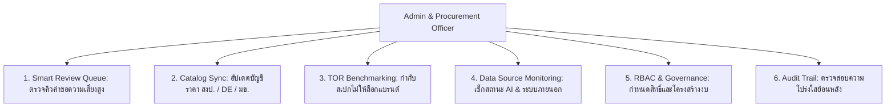
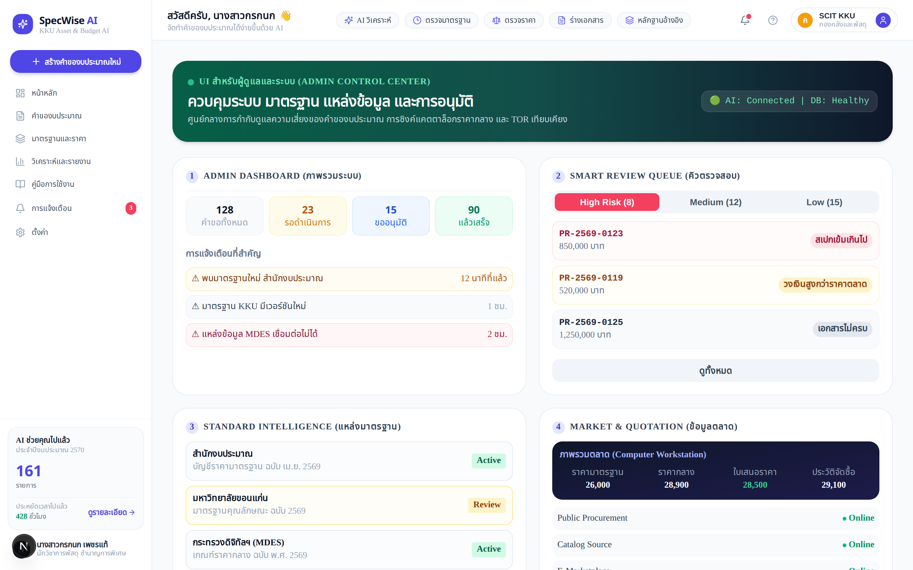
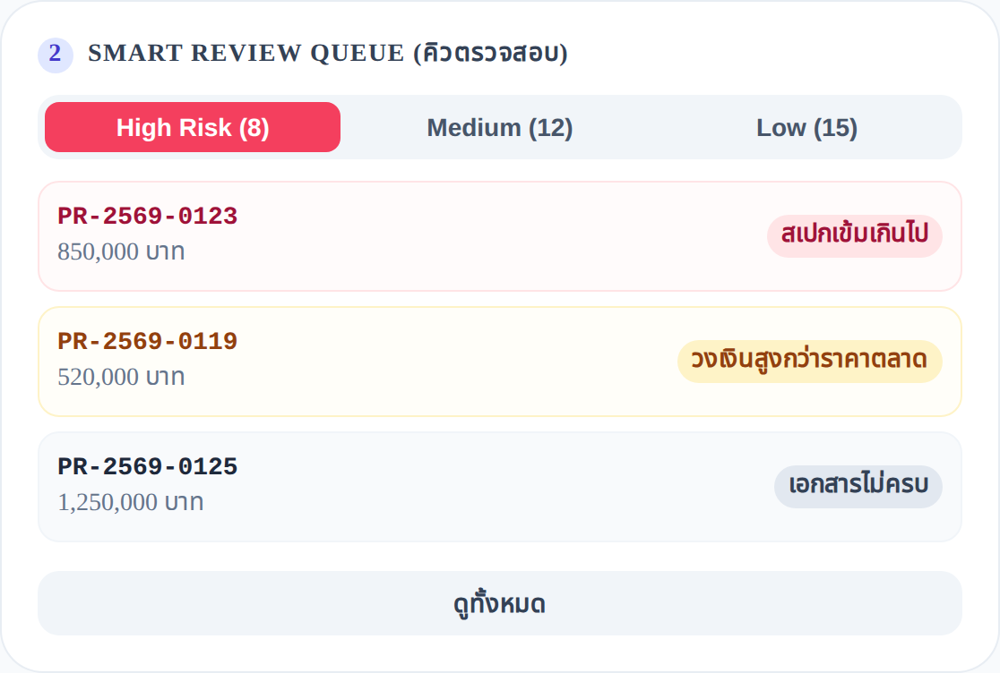
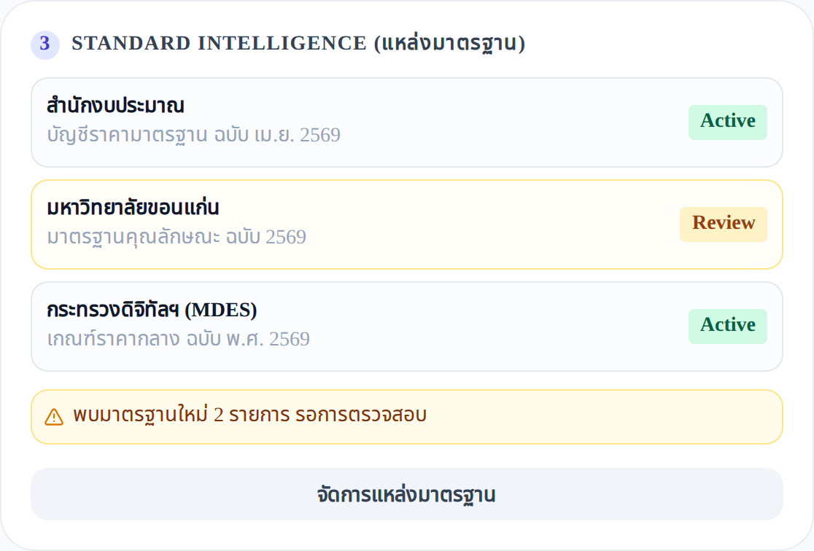
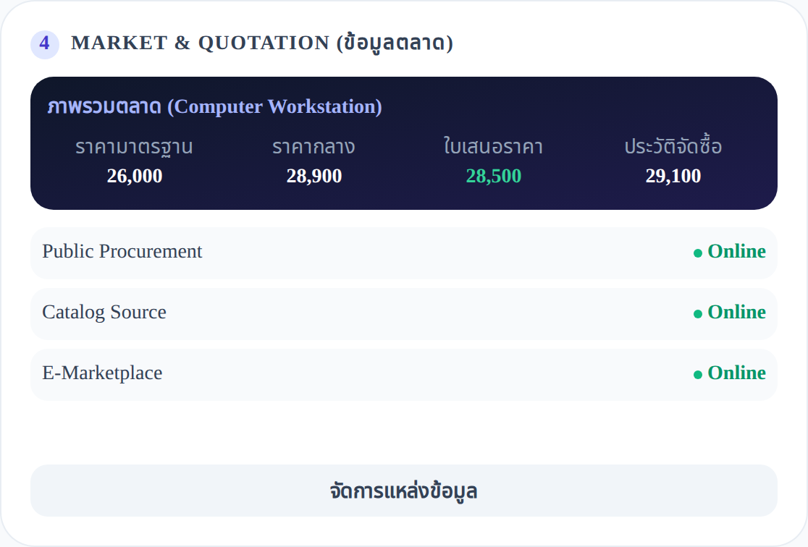
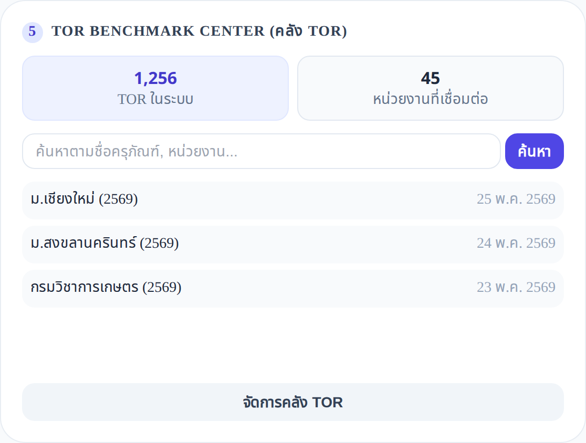
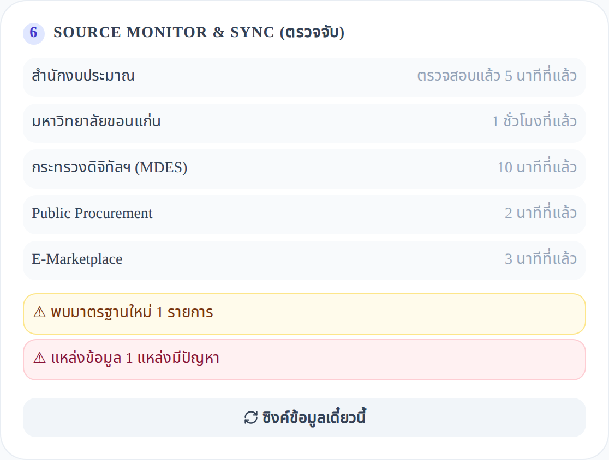

# 🛠️ คู่มือสำหรับผู้ดูแลระบบและเจ้าหน้าที่พัสดุ (Admin & Governance Manual)
### SpecWise AI — AI Intelligent Asset Budget & Specification Assistant • Khon Kaen University

---

## 📑 สารบัญ (Table of Contents)

1. [บทบาทและหน้าที่ของผู้ดูแลระบบ (Admin Role & Responsibilities)](#1-บทบาทและหน้าที่ของผู้ดูแลระบบ)
2. [การเข้าสู่ศูนย์ควบคุมระบบ (Admin Control Center Overview)](#2-การเข้าสู่ศูนย์ควบคุมระบบ)
3. [ระบบคิวตรวจสอบอัจฉริยะ (Smart Review Queue)](#3-ระบบคิวตรวจสอบอัจฉริยะ)
4. [การจัดการบัญชีราคามาตรฐานและแคตตาล็อก (Reference Catalogs & Pricing)](#4-การจัดการบัญชีราคามาตรฐานและแคตตาล็อก)
5. [ศูนย์เทียบเคียงและกำกับมาตรฐาน TOR (TOR Benchmarking Hub)](#5-ศูนย์เทียบเคียงและกำกับมาตรฐาน-tor)
6. [การตรวจสอบสถานะการเชื่อมต่อแหล่งข้อมูล (Data Source & Integrations Monitoring)](#6-การตรวจสอบสถานะการเชื่อมต่อแหล่งข้อมูล)
7. [การกำกับดูแล สิทธิ์ และบันทึกประวัติการตรวจสอบ (Governance, RBAC & Audit Trail)](#7-การกำกับดูแล-สิทธิ์-และบันทึกประวัติการตรวจสอบ)
8. [ความมั่นคงปลอดภัยและการป้องกันความเสี่ยง (Security Hardening & Governance)](#8-ความมั่นคงปลอดภัยและการป้องกันความเสี่ยง)
9. [การบำรุงรักษาระบบและคำสั่งจัดการฐานข้อมูล (Operations & Maintenance Runbook)](#9-การบำรุงรักษาระบบและคำสั่งจัดการฐานข้อมูล)

---

## 1. บทบาทและหน้าที่ของผู้ดูแลระบบ

ผู้ดูแลระบบของ **SpecWise AI** (ประกอบด้วย เจ้าหน้าที่บริหารงานพัสดุ กองคลังและพัสดุ มหาวิทยาลัยขอนแก่น, เจ้าหน้าที่วิเคราะห์นโยบายและแผน, และผู้ดูแลระบบไอที) มีบทบาทหน้าที่สำคัญในการกำกับดูแล 6 มิติ:



---

## 2. การเข้าสู่ศูนย์ควบคุมระบบ

**URL:** `/admin` *(เฉพาะผู้ใช้ที่มีบทบาท `ADMIN` เท่านั้น หากสิทธิ์ไม่ถึงระบบจะ Redirect กลับไปยังหน้า `/requests`)*



### 📊 แผงสรุปสถานะระบบ (Top KPI Banner):
- **สถานะการเชื่อมต่อ AI & Database**: `🟢 AI: Connected | DB: Healthy` แสดงสถานะความพร้อมของ KKU IntelSphere LLM และ PostgreSQL Vector DB
- **ตัวเลขสถิติภาพรวม 4 ด้าน**:
  1. **คำขอทั้งหมด (Total Requests)**: เช่น 128 คำขอ
  2. **รอดำเนินการ (Pending)**: 23 คำขอ
  3. **ขออนุมัติ (Awaiting Approval)**: 15 คำขอ
  4. **แล้วเสร็จ (Completed)**: 90 คำขอ
- **การแจ้งเตือนระดับวิกฤต (Critical Notifications)**: แจ้งเตือนเมื่อตรวจพบบัญชีมาตรฐานเวอร์ชันใหม่, แหล่งข้อมูลเชื่อมต่อขัดข้อง หรือคำขอที่มีความเสี่ยงสูง

---

## 3. ระบบคิวตรวจสอบอัจฉริยะ (Smart Review Queue)

คิวตรวจสอบอัจฉริยะช่วยให้เจ้าหน้าที่พัสดุสามารถจัดลำดับความสำคัญในการตรวจเอกสารคำขอตามระดับความเสี่ยงของคำขอได้อย่างมีประสิทธิภาพ



### 3.1 การจัดระดับความเสี่ยง (Risk Categorization):
- 🔴 **High Risk (ความเสี่ยงสูง)**:
  - คำขอที่ราคาสูงกว่าเกณฑ์มาตรฐานเกิน 15%
  - คำขอที่มีการตรวจพบชื่อทางการค้า/ยี่ห้อ (Brand Mentions) ในร่างสเปก
  - คำขอที่ไม่มีเอกสารใบเสนอราคาเทียบเคียงครบ 3 ราย
- 🟡 **Medium Risk (ความเสี่ยงปานกลาง)**:
  - คำขอนอกบัญชีมาตรฐานที่มีเหตุผลความจำเป็นต้องใช้สเปกพิเศษ
  - คำขอที่มีการจัดซื้อจำนวนมาก (เกิน 50 ชุด หรือวงเงินเกิน 2 ล้านบาท)
- 🟢 **Low Risk (ความเสี่ยงต่ำ / Fast-track)**:
  - คำขอที่ตรงตามมาตรฐานสำนักงบประมาณ 100% ราคาไม่เกินเกณฑ์ พร้อมเข้าสู่การอนุมัติแบบด่วน

### 3.2 การดำเนินการของเจ้าหน้าที่ (Action Items):
1. คลิกเลือกคำขอจากรายการเพื่อดูรายละเอียดผลวิเคราะห์ของ AI
2. ตรวจสอบ **ตารางเปรียบเทียบราคา 4 แหล่ง** และ **การตรวจจับคำล็อกสเปก**
3. เลือกดำเนินการ:
   - **อนุมัติผ่านเกณฑ์ (Approve)**
   - **ส่งกลับแก้ไขพร้อมข้อแนะนำ (Request Revision with Notes)**
   - **ปฏิเสธคำขอ (Reject)**

---

## 4. การจัดการบัญชีราคามาตรฐานและแคตตาล็อก (Reference Catalogs & Pricing)



### 4.1 แหล่งข้อมูลแคตตาล็อกที่รองรับ:
1. **บัญชีราคามาตรฐานครุภัณฑ์ สำนักงบประมาณ (สงป. 2569)**
2. **เกณฑ์ราคากลางและคุณลักษณะพื้นฐาน ICT กระทรวงดิจิทัลฯ (MDES 2569)**
3. **บัญชีราคามาตรฐาน มหาวิทยาลัยขอนแก่น (KKU Internal Catalog 2569)**
4. **ฐานข้อมูลสัญญาย้อนหลังและการจัดซื้อจัดจ้าง มข. (Historical Contract Database)**

### 4.2 การอัปเดตและซิงค์ข้อมูล:
- **ปุ่ม Sync ข้อมูล**: กดเพื่อดึงข้อมูลเวอร์ชันล่าสุดจากฐานข้อมูลกลาง
- **ระบบตรวจจับเวอร์ชัน (Version Control)**: แจ้งเตือนเมื่อหน่วยงานภาครัฐประกาศเกณฑ์ฉบับใหม่
- **การจัดการ Embedding Vector**: คำนวณ Semantic Vector ของรายการครุภัณฑ์ใหม่อัตโนมัติ เพื่อให้ระบบสืบค้นด้วยภาษาธรรมชาติ (Semantic Search) ได้แม่นยำ

---

## 5. ศูนย์เทียบเคียงและกำกับมาตรฐาน TOR (TOR Benchmarking Hub)



### 5.1 ฟังก์ชันการตรวจสอบคุณลักษณะเฉพาะ:
- **เครื่องมือค้นหาและเปรียบเทียบ TOR ย้อนหลัง**: ค้นหาโครงการจัดซื้อในอดีตที่มีสเปกใกล้เคียงกัน เพื่อใช้อ้างอิงราคาและเกณฑ์การตรวจรับ
- **Procurement Spec Linter (ระบบตรวจคำต้องห้าม)**:
  - สแกนเอกสารเพื่อตรวจหาชื่อยี่ห้อ (Brand Names เช่น Apple, Dell, Cisco, Intel, Nvidia)
  - ตรวจสอบคุณลักษณะที่เป็นการเจาะจงเทคโนโลยีเฉพาะรายเดียว (Proprietary Spec Lock)
  - แนะนำคำอธิบายที่เป็นกลางตามมาตรฐานสากล (Performance-based neutral description)

---

## 6. การตรวจสอบสถานะการเชื่อมต่อแหล่งข้อมูล (Data Source & Integrations Monitoring)



ผู้ดูแลระบบสามารถตรวจสอบสุขภาพ (Health Status) ของระบบเชื่อมต่อภายนอกทั้งหมดได้แบบเรียลไทม์:

| แหล่งข้อมูล / ระบบเชื่อมต่อ | โปรโตคอล / Endpoint | วัตถุประสงค์การใช้งาน | สถานะปกติ |
| :--- | :--- | :--- | :---: |
| **KKU SSONext** | OAuth2 / OIDC | ยืนยันตัวตนบุคลากร มข. แบบ Single Sign-On | `🟢 Connected` |
| **KKU Employee API v3** | REST API + API Key | ดึงข้อมูลสังกัด คณะ สาขา และสิทธิ์ | `🟢 Active` |
| **KKU IntelSphere LLM** | OpenAI-compatible API | ประมวลผลและสร้างสเปก 6 ขั้นตอน (`gpt-5.6-luna`) | `🟢 Healthy` |
| **MinIO S3 Storage** | S3 API (Port 9000) | จัดเก็บไฟล์ใบเสนอราคาและ PDF รวมฉบับสมบูรณ์ | `🟢 Online` |
| **PostgreSQL + pgvector** | Port 5432 | ฐานข้อมูลหลักและเวกเตอร์ค้นหา RAG | `🟢 Ready` |
| **e-GP Open Data API** | REST API กรมบัญชีกลาง | ดึงดัชนีราคากลางและการจัดซื้อภาครัฐ | `🟢 Syncing` |

---

## 7. การกำกับดูแล สิทธิ์ และบันทึกประวัติการตรวจสอบ (Governance, RBAC & Audit Trail)



### 7.1 การกำหนดบทบาทผู้ใช้งาน (RBAC Management):
- **REQUESTER**: สิทธิ์สร้างและแก้ไขคำขอของตนเอง, อัปโหลดเอกสาร, ดูสถานะ
- **DEPT_VERIFIER**: สิทธิ์ตรวจทานคำขอภายในภาควิชา/ส่วนงาน, ให้ข้อเสนอแนะ, ส่งต่อคณะ
- **APPROVER**: สิทธิ์พิจารณาอนุมัติคำขอระดับคณะ, บรรจุเข้าแผนงบประมาณ
- **ADMIN**: สิทธิ์เข้าถึง Admin Control Center, จัดการแคตตาล็อก, ตรวจสอบ Audit Log, กำหนดค่าระบบ

### 7.2 บันทึกประวัติการทำรายการ (Immutable Audit Logs):
ระบบบันทึกทุกเหตุการณ์ที่เกิดขึ้นในระบบพร้อม Timestamp, ผู้ดำเนินการ, IP Address และรายละเอียดการเปลี่ยนแปลง:
- บันทึกการสร้างคำขอ (Proposal Creation)
- บันทึกการแก้ไขสเปกหรือราคา (Spec & Price Adjustments)
- บันทึกผลการวิเคราะห์ของ AI (AI Prompt & Output Snapshot)
- บันทึกการส่งต่อและการอนุมัติ (Workflow Transition History)

---

## 8. ความมั่นคงปลอดภัยและการป้องกันความเสี่ยง (Security Hardening)

### 8.1 การป้องกันการโจมตี AI (Anti-Prompt Injection & Safety Filters)
- **Input Sanitization**: สแกนข้อความความต้องการจากผู้ใช้เพื่อป้องกันคำสั่ง Override คำแนะนำ AI หรือพยายามปรับลดความเข้มงวดในการตรวจราคา
- **Zero Hallucination Grounding**: ทุกข้อเสนอแนะของ AI ต้องมี Citation อ้างอิงหน้าที่และบรรทัดจากเอกสารเกณฑ์มาตรฐานจริง

### 8.2 การรักษาความปลอดภัยของไฟล์และข้อมูล (Document & Storage Security)
- **Presigned URLs**: การเข้าถึงไฟล์แนบใน MinIO S3 มีการจำกัดเวลาและตรวจสอบ Token สิทธิ์การเข้าถึง
- **Single-PDF Merge Validation**: ไฟล์แนบทั้งหมดจะถูกรวมเป็น PDF ฉบับเดียวเพื่อป้องกันการสับเปลี่ยนเอกสารภายหลัง

---

## 9. การบำรุงรักษาระบบและคำสั่งจัดการฐานข้อมูล (Operations Runbook)

### 9.1 การเริ่มและหยุดระบบด้วย Docker Compose
```bash
# เริ่มต้นบริการฐานข้อมูล PostgreSQL และ MinIO Storage
docker compose up -d

# ตรวจสอบสถานะคอนเทนเนอร์
docker compose ps

# ดูบันทึกการทำงาน (Logs)
docker compose logs -f
```

### 9.2 การรัน Migration และ Seed แคตตาล็อกมาตรฐาน
```bash
# สร้าง Prisma Client
pnpm run db:generate

# ซิงค์ Schema ไปยังฐานข้อมูล
pnpm run db:push

# นำเข้าข้อมูลแคตตาล็อกมาตรฐาน สำนักงบประมาณ 2569, DE 2569 และ มข.
pnpm run db:seed
```

สำหรับ UAT/production ที่รันด้วย Docker Compose ให้รันคำสั่งจากภายใน
application container หลังจาก `docker compose up -d` และฐานข้อมูลพร้อมใช้งาน:
```bash
# ซิงค์ Schema และนำเข้าข้อมูลแคตตาล็อกมาตรฐาน
docker compose exec app pnpm run db:push
docker compose exec app pnpm run db:seed

# นำเข้าชุดข้อมูลคำของบประมาณตัวอย่าง 40 รายการเพิ่มเติม (สำหรับ UAT เท่านั้น)
docker compose exec app pnpm run db:seed:proposals
```

### 9.3 การทดสอบระบบอัตโนมัติ (Automated Testing)
```bash
# รัน Unit Tests & Integration Tests ทั้งหมด
pnpm test
```

### 9.4 การแคปเจอร์ภาพหน้าจอคู่มืออัตโนมัติ (Screenshot Automation)
```bash
# รัน Playwright เพื่ออัปเดตภาพหน้าจอสำหรับคู่มือการใช้งานทั้งหมด
node scripts/capture-manual-screenshots.mjs
```

---
*จัดทำโดย: ฝ่ายพัฒนาระบบและนวัตกรรมดิจิทัล SpecWise AI • KKU AI Hackathon 2026 • มหาวิทยาลัยขอนแก่น*
