# 📘 คู่มือการใช้งานระบบ SpecWise AI (สำหรับผู้ใช้งานทั่วไป)
### AI Intelligent Asset Budget & Specification Assistant — Khon Kaen University

---

## 📑 สารบัญ (Table of Contents)

1. [บทนำและภาพรวมระบบ (System Overview)](#1-บทนำและภาพรวมระบบ)
2. [การเข้าสู่ระบบและบทบาทผู้ใช้งาน (Login & Authentication)](#2-การเข้าสู่ระบบและบทบาทผู้ใช้งาน)
3. [หน้าแดชบอร์ดและรายการคำของบประมาณ (Dashboard & Requests)](#3-หน้าแดชบอร์ดและรายการคำของบประมาณ)
4. [ขั้นตอนการจัดทำคำของบประมาณด้วย AI 6+3 ขั้นตอน (AI Wizard Flow)](#4-ขั้นตอนการจัดทำคำของบประมาณด้วย-ai)
   - [ขั้นตอนที่ 1: ระบุความต้องการครุภัณฑ์ (Intent Specification)](#ขั้นตอนที่-1-ระบุความต้องการครุภัณฑ์)
   - [ขั้นตอนที่ 2: แมตช์บัญชีมาตรฐานครุภัณฑ์ (Catalog Match & Confidence Score)](#ขั้นตอนที่-2-แมตช์บัญชีมาตรฐานครุภัณฑ์)
   - [ขั้นตอนที่ 3: ตรวจสอบและเปรียบเทียบราคา 4 แหล่ง (4-Source Price Cross-Check)](#ขั้นตอนที่-3-ตรวจสอบและเปรียบเทียบราคา-4-แหล่ง)
   - [ขั้นตอนที่ 4: ตรวจสอบความสมเหตุสมผลและแจ้งเตือนงบประมาณ (Budget Reasonableness & Alert)](#ขั้นตอนที่-4-ตรวจสอบความสมเหตุสมผลและแจ้งเตือนงบประมาณ)
   - [ขั้นตอนที่ 5: ตรวจทานและแก้ไขแบบฟอร์มคำขอ 8 ส่วน (8-Section Proposal Form)](#ขั้นตอนที่-5-ตรวจทานและแก้ไขแบบฟอร์มคำขอ-8-ส่วน)
   - [ขั้นตอนที่ 6: จัดทำร่างคุณลักษณะเฉพาะที่เป็นกลาง (Neutral Spec & TOR Generator)](#ขั้นตอนที่-6-จัดทำร่างคุณลักษณะเฉพาะที่เป็นกลาง)
   - [ขั้นตอนที่ 7: เครื่องมือเทียบเคียง TOR ย้อนหลัง (TOR Benchmarking)](#ขั้นตอนที่-7-เครื่องมือเทียบเคียง-tor-ย้อนหลัง)
   - [ขั้นตอนที่ 8: แนบเอกสารหลักฐานและรวมไฟล์ PDF (Single Merged PDF)](#ขั้นตอนที่-8-แนบเอกสารหลักฐานและรวมไฟล์-pdf)
   - [ขั้นตอนที่ 9: ตรวจสอบความถูกต้องและยืนยันการส่งคำขอ (Review & Submit)](#ขั้นตอนที่-9-ตรวจสอบความถูกต้องและยืนยันการส่งคำขอ)
5. [การติดตามสถานะและการส่งออกเอกสารทางการ (Request Tracking & Export)](#5-การติดตามสถานะและการส่งออกเอกสารทางการ)
6. [การสืบค้นคลังบัญชีครุภัณฑ์มาตรฐาน (Standard Catalogs Search)](#6-การสืบค้นคลังบัญชีครุภัณฑ์มาตรฐาน)
7. [รายงานสถิติและผลการวิเคราะห์ภาพรวม (Reports & Analytics)](#7-รายงานสถิติและผลการวิเคราะห์ภาพรวม)
8. [ศูนย์การแจ้งเตือนและการตั้งค่าระบบ (Notifications & Settings)](#8-ศูนย์การแจ้งเตือนและการตั้งค่าระบบ)
9. [คำถามที่พบบ่อยและข้อแนะนำ (FAQ & Best Practices)](#9-คำถามที่พบบ่อยและข้อแนะนำ)

---

## 1. บทนำและภาพรวมระบบ

**SpecWise AI** คือระบบผู้ช่วยอัจฉริยะที่พัฒนาขึ้นเพื่อปฏิวัติกระบวนการจัดทำคำของบประมาณและข้อกำหนดคุณลักษณะเฉพาะ (สเปก / TOR) ครุภัณฑ์ของมหาวิทยาลัยขอนแก่น 

### 🎯 ประโยชน์หลักสำหรับผู้ใช้งาน
- **ประหยัดเวลา**: ลดเวลาการร่างเอกสารและค้นหาข้อมูลราคาจากเฉลี่ย 3-5 วัน เหลือเพียง **ไม่เกิน 5 นาที**
- **สอดคล้องตามระเบียบ 100%**: ตรวจสอบเทียบเคียงกับเกณฑ์มาตรฐานสำนักงบประมาณ พ.ศ. 2569, เกณฑ์กระทรวงดิจิทัลเพื่อเศรษฐกิจและสังคม (MDES) 2569 และบัญชีราคามาตรฐาน มข.
- **ป้องกันข้อผิดพลาดและลดการตีกลับ**: AI วิเคราะห์ความสมเหตุสมผล ตรวจสอบราคา 4 แหล่ง และคัดกรองคำที่เข้าข่ายล็อกสเปกโดยอัตโนมัติ
- **พร้อมส่งออกเอกสารมาตรฐาน**: รองรับการสร้างไฟล์ PDF คำขอทางการของมหาวิทยาลัย และเอกสาร Excel สรุปรายการงบประมาณทันที

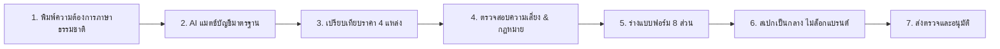

---

## 2. การเข้าสู่ระบบและบทบาทผู้ใช้งาน

เมื่อเข้าสู่ระบบผ่านเว็บเบราว์เซอร์ จะพบกับหน้าต่างเข้าสู่ระบบที่มีระบบความปลอดภัยตามมาตรฐานมหาวิทยาลัยขอนแก่น

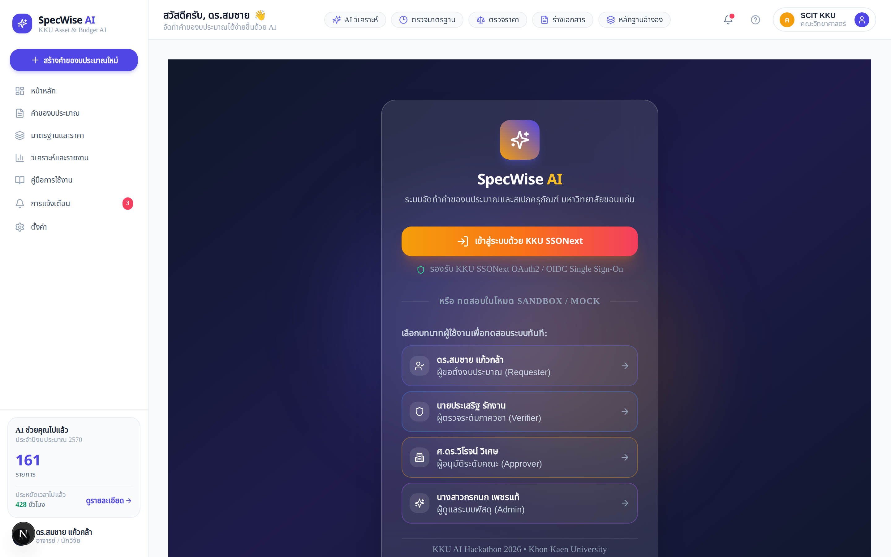

### 2.1 การเข้าสู่ระบบจริง (Production Mode)
1. คลิกที่ปุ่ม **"เข้าสู่ระบบด้วย KKU SSONext"**
2. ระบบจะนำท่านไปยังหน้ายืนยันตัวตนของมหาวิทยาลัยขอนแก่น (KKU SSONext OIDC)
3. กรอกอีเมลสถาบัน (`@kku.ac.th`) และรหัสผ่าน
4. ระบบจะดึงข้อมูลสังกัด คณะ สาขาวิชา และสิทธิ์การตั้งงบประมาณผ่าน **KKU Employee API v3** โดยอัตโนมัติ

### 2.2 การเข้าสู่ระบบในโหมดจำลอง (Sandbox / Mock Mode)
สำหรับการทดสอบการใช้งาน ผู้ใช้สามารถเลือกสลับบทบาทได้ทันที 4 รูปแบบ:
| บทบาท (Role) | ผู้ใช้งานตัวอย่าง | หน้าที่และความรับผิดชอบ |
| :--- | :--- | :--- |
| **Requester** | ดร.สมชาย แก้วกล้า (คณะวิทยาศาสตร์) | จัดทำคำของบประมาณ ร่างสเปกครุภัณฑ์ และส่งตรวจ |
| **Dept Verifier** | นายประเสริฐ รักงาน (งานแผนและนโยบาย) | ตรวจสอบความถูกต้องและงบประมาณระดับภาควิชา/ส่วนงาน |
| **Approver** | ศ.ดร.วิโรจน์ วิเศษ (คณบดีคณะวิทยาศาสตร์) | พิจารณาอนุมัติและบรรจุเข้าสู่แผนงบประมาณระดับคณะ |
| **Admin** | นางสาวกรกนก เพชรแท้ (กองคลังและพัสดุ มข.) | ควบคุมระบบ ตรวจสอบคิวความเสี่ยง และจัดการบัญชีมาตรฐาน |

---

## 3. หน้าแดชบอร์ดและรายการคำของบประมาณ

หลังจากเข้าสู่ระบบ ผู้ใช้จะเข้าสู่หน้า **คำของบประมาณครุภัณฑ์ (Requests Dashboard)**

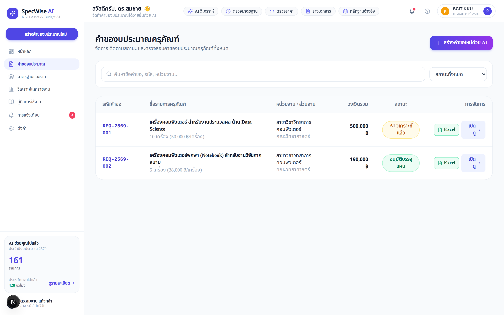

### ฟังก์ชันสำคัญบนหน้าแดชบอร์ด:
1. **ปุ่มสร้างคำขอใหม่ด้วย AI**: คลิกปุ่มสีม่วง `+ สร้างคำขอใหม่ด้วย AI` ที่มุมขวาบนเพื่อเริ่มจัดทำคำขอ
2. **กล่องค้นหาอัจฉริยะ (Search Box)**: ค้นหาคำขอด้วยรหัสคำขอ (เช่น `REQ-2569-001`), ชื่อรายการครุภัณฑ์ หรือหน่วยงาน
3. **แถบตัวกรองสถานะ (Status Filter)**:
   - **ทั้งหมด (All)**: แสดงรายการคำขอทุกสถานะ
   - **แบบร่าง (Draft)**: คำขอที่กำลังจัดทำยังไม่ส่งตรวจ
   - **AI วิเคราะห์แล้ว (AI Analyzed)**: ผ่านการวิเคราะห์และพร้อมตรวจทาน
   - **รอตรวจระดับภาควิชา (Dept Review)**: อยู่ระหว่างการตรวจทานโดยเจ้าหน้าที่แผน
   - **ส่งระดับคณะแล้ว (Submitted)**: อยู่ระหว่างเสนอผู้บริหาร/คณบดี
   - **อนุมัติบรรจุแผน (Approved)**: ได้รับการอนุมัติเรียบร้อยแล้ว
   - **ส่งกลับแก้ไข (Revised)**: ผู้ตรวจส่งข้อเสนอแนะให้ปรับปรุง

---

## 4. ขั้นตอนการจัดทำคำของบประมาณด้วย AI

ระบบ SpecWise AI ออกแบบการทำงานในรูปแบบ **Interactive 6+3 Step Wizard** ที่นำทางผู้ใช้ตั้งแต่เริ่มต้นจนส่งเอกสารสำเร็จ

---

### ขั้นตอนที่ 1: ระบุความต้องการครุภัณฑ์
**URL:** `/requests/new?step=1`

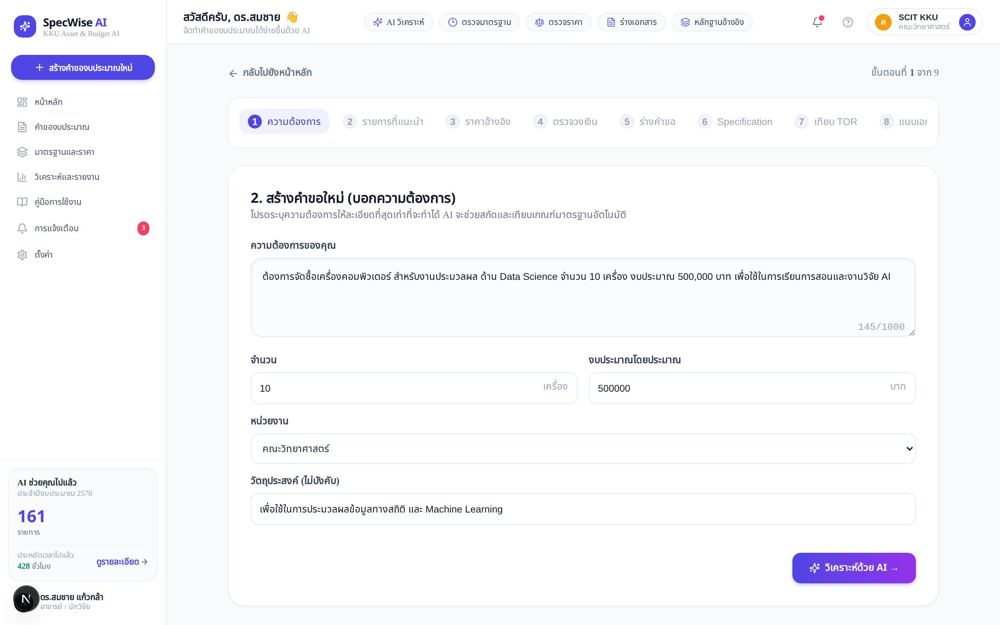

#### วิธีการใช้งาน:
1. **กรอกความต้องการภาษาธรรมชาติ (Prompt Input)**: พิมพ์รายละเอียดครุภัณฑ์ที่ต้องการ เช่น:
   > *"ต้องการจัดซื้อเครื่องคอมพิวเตอร์ สำหรับงานประมวลผล ด้าน Data Science จำนวน 10 เครื่อง งบประมาณ 500,000 บาท เพื่อใช้ในการเรียนการสอนและงานวิจัย AI"*
2. **ระบุจำนวนและวงเงินโดยประมาณ**: ระบบจะดึงตัวเลขจากข้อความมาเติมในช่อง **จำนวน (เครื่อง/ชุด)** และ **วงเงินงบประมาณรวม (บาท)** ให้อัตโนมัติ หรือผู้ใช้สามารถแก้ไขเพิ่มเติมได้
3. **อัปโหลดใบเสนอราคา/เอกสารเดิม (ถ้ามี)**: รองรับไฟล์ PDF/รูปภาพ เพื่อให้ AI สกัดสเปกและราคาอ้างอิง
4. คลิกปุ่ม **"ถัดไป: แมตช์บัญชีมาตรฐาน"** หรือคลิก **"ให้ AI วิเคราะห์ใหม่"**

---

### ขั้นตอนที่ 2: แมตช์บัญชีมาตรฐานครุภัณฑ์
**URL:** `/requests/new?step=2`

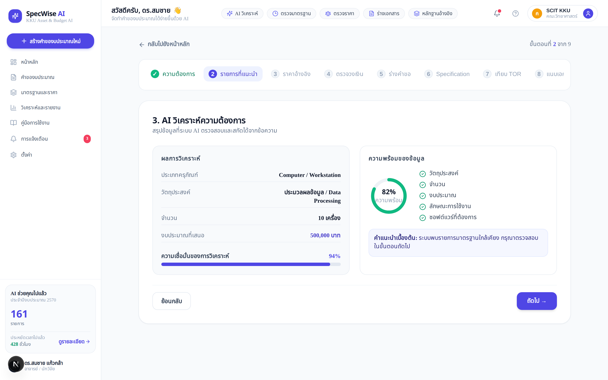

#### ข้อมูลที่ AI วิเคราะห์และนำเสนอ:
- **ชื่อรายการมาตรฐานที่ตรงกัน**: เช่น *เครื่องคอมพิวเตอร์ สำหรับงานประมวลผล แบบที่ 1*
- **แหล่งอ้างอิง**: เกณฑ์ราคากลางและคุณลักษณะพื้นฐาน สำนักงบประมาณ 2569 / MDES 2569
- **คะแนนความมั่นใจ (Confidence Score)**: เช่น `94% Match` พร้อมเหตุผลประกอบ
- **หมวดหมู่และอายุการใช้งานมาตรฐาน**: แสดงอายุการใช้งานพัสดุตามเกณฑ์กรมบัญชีกลาง (เช่น 5 ปี)

---

### ขั้นตอนที่ 3: ตรวจสอบและเปรียบเทียบราคา 4 แหล่ง
**URL:** `/requests/new?step=3`

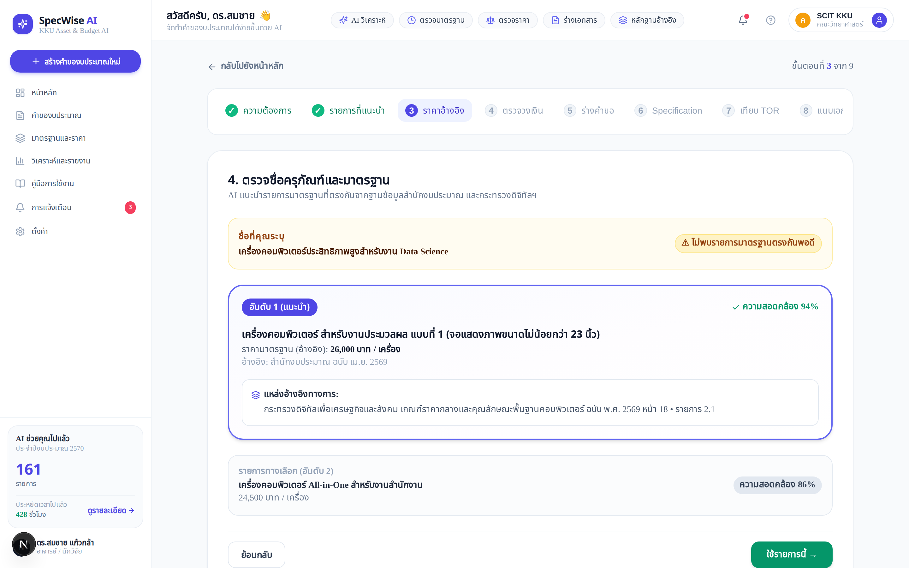

#### แหล่งราคาอ้างอิง 4 ด้าน (4-Source Governance):
1. **เกณฑ์สำนักงบประมาณ / DE (Catalog Standard)**: 45,000 บาท/เครื่อง
2. **สัญญาย้อนหลัง มข. (KKU Historical Contracts)**: 43,500 บาท/เครื่อง (สัญญาเลขที่ มข.พด. 112/2568)
3. **ราคาตลาด/ใบเสนอราคาเฉลี่ย (Market Quotations)**: 48,000 บาท/เครื่อง (จาก 3 ผู้จำหน่าย)
4. **ราคากลาง e-GP กรมบัญชีกลาง (e-GP Price Index)**: 44,800 บาท/เครื่อง

> [!TIP]
> **ระบบคำนวณราคากลางที่แนะนำอัตโนมัติ**: AI จะประมวลผลราคากลางที่เหมาะสมและถูกต้องตามระเบียบจัดซื้อจัดจ้างภาครัฐ พร้อมแสดงค่าเบี่ยงเบน (Variance) เพื่อป้องกันการตั้งราคาสูงหรือต่ำเกินจริง

---

### ขั้นตอนที่ 4: ตรวจสอบความสมเหตุสมผลและแจ้งเตือนงบประมาณ
**URL:** `/requests/new?step=4`

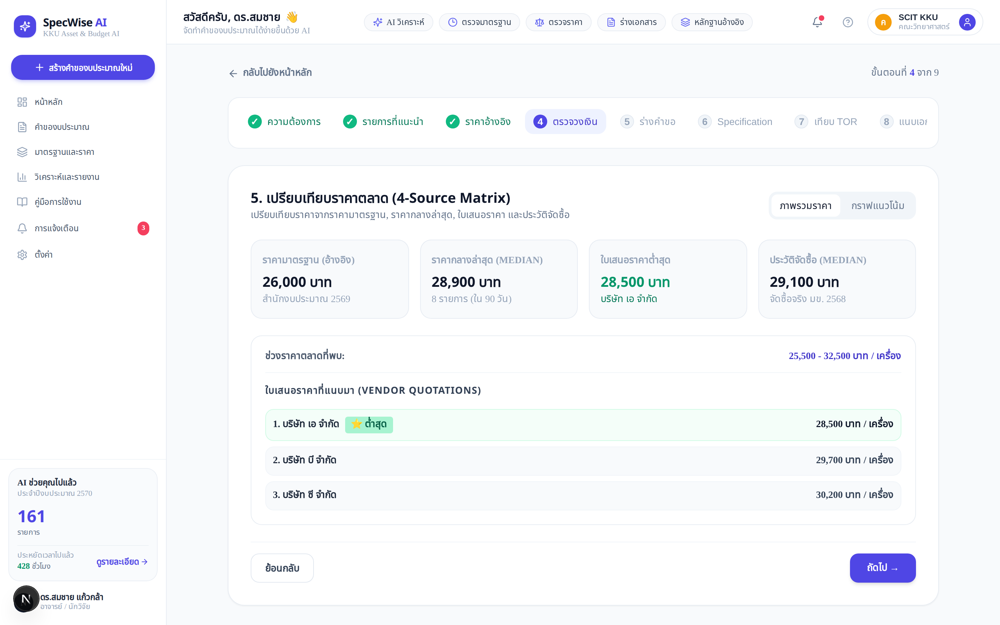

#### ระบบสัญญาณไฟเตือนความเสี่ยง (Procurement Traffic Light Alert):
- 🟢 **Green Alert (ผ่านเกณฑ์)**: ราคาและสเปกอยู่ในเกณฑ์มาตรฐาน ไม่เกินวงเงิน
- 🟡 **Amber Alert (แจ้งเตือนเพื่อชี้แจง)**: ราคาเบี่ยงเบนจากมาตรฐานเล็กน้อย (เช่น +6.7%) เนื่องจากจำเป็นต้องใช้ GPU ประมวลผลสูง ต้องมีเหตุผลความคุ้มค่าประกอบ
- 🔴 **Red Alert (ตรวจพบข้อผิดพลาดร้ายแรง)**: ราคาสูงเกินเกณฑ์มากกว่า 20% หรือพบการระบุแบรนด์สินค้าชัดเจน

#### การวิเคราะห์ความคุ้มค่า (Value-Add Analysis):
- จำแนกสเปกเป็นส่วน **Value-Added (จำเป็นต่องานวิจัย/การสอน)** และ **Non-Value-Added (ฟุ่มเฟือยเกินความจำเป็น)**

---

### ขั้นตอนที่ 5: ตรวจทานและแก้ไขแบบฟอร์มคำขอ 8 ส่วน
**URL:** `/requests/new?step=5`

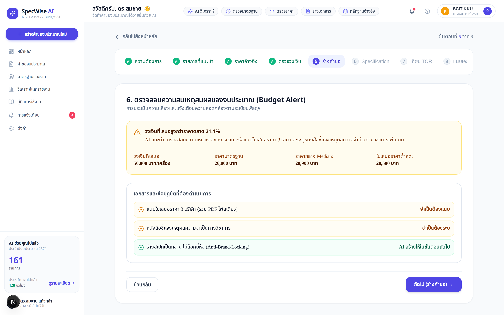

#### AI ร่างแบบฟอร์มคำขอทางการ 8 หัวข้อสำคัญ:
1. **ชื่อโครงการและรายการครุภัณฑ์**: รหัสพัสดุและชื่อทางการ
2. **หลักการและเหตุผล (Background & Justification)**: อ้างอิงยุทธศาสตร์ มข. และแผนพัฒนานวัตกรรม
3. **วัตถุประสงค์ (Objectives)**: เชิงปริมาณและคุณภาพ
4. **กลุ่มเป้าหมายและผู้รับประโยชน์ (Target Beneficiaries)**: อาจารย์ นักศึกษา และนักวิจัย
5. **ความคุ้มค่าและผลสัมฤทธิ์ (Value Proposition & ROI)**: อัตราการใช้งานและผลงานวิจัยที่คาดหวัง
6. **แผนและสถานที่ติดตั้ง (Installation & Readiness)**: ห้องปฏิบัติการ ความพร้อมระบบไฟฟ้าและเครือข่าย
7. **แผนการบำรุงรักษาและการรับประกัน (Maintenance & Warranty Plan)**: เงื่อนไข On-site Service 3 ปี
8. **ประมาณการงบประมาณและแหล่งเงิน (Budget Breakdown)**: งบลงทุน / เงินรายได้คณะ

> [!NOTE]
> ผู้ใช้งานสามารถคลิกแก้ไขข้อความในแต่ละส่วนได้อิสระ โดยมีระบบช่วยบันทึกการเปลี่ยนแปลงแบบเรียลไทม์

---

### ขั้นตอนที่ 6: จัดทำร่างคุณลักษณะเฉพาะที่เป็นกลาง (Neutral Spec / TOR)
**URL:** `/requests/new?step=6`

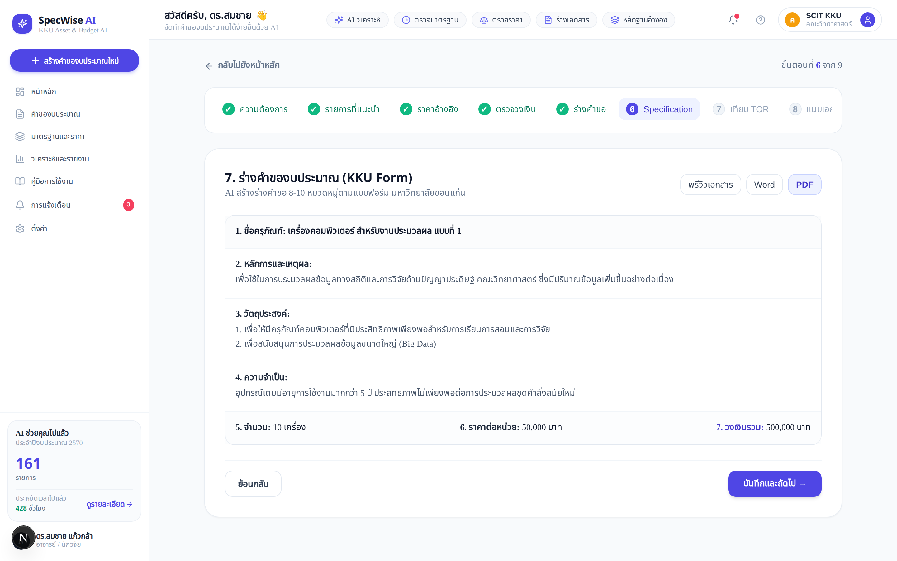

#### จุดเด่นของระบบร่างสเปกอัจฉริยะ:
- **ป้องกันการล็อกสเปก (Anti-Brand-Locking)**: สเปกจะไม่มีการระบุยี่ห้อเฉพาะเจาะจง แต่ใช้เกณฑ์สมรรถนะ (Performance-based Spec)
- **แยกหมวดหมู่สเปกชัดเจน**:
  - หน่วยประมวลผลกลาง (CPU Core / Frequency)
  - หน่วยประมวลผลกราฟิก (GPU Memory Bandwidth / Tensor Cores)
  - หน่วยความจำหลัก (RAM DDR5 ECC)
  - หน่วยจัดเก็บข้อมูล (NVMe PCIe 4.0 Read/Write IOPS)
  - การรับประกันและบริการหลังการขาย (SLA Response Time)

---

### ขั้นตอนที่ 7: เครื่องมือเทียบเคียง TOR ย้อนหลัง
**URL:** `/requests/new?step=7`

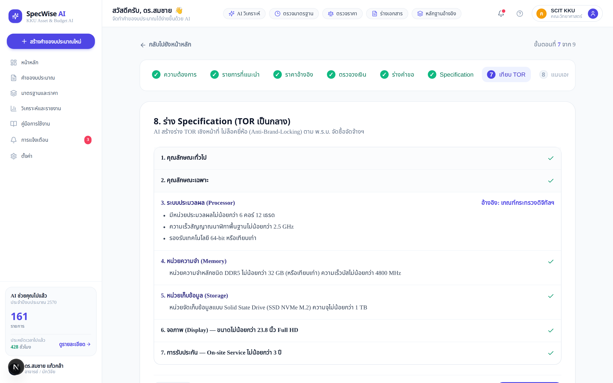

- เปรียบเทียบสเปกปัจจุบันกับ **โครงการจัดซื้อเดิมของมหาวิทยาลัยขอนแก่น** ในรอบ 3 ปี
- แสดงจุดที่พัฒนาขึ้น จุดที่ปรับปรุงความคุ้มค่า และการปฏิบัติตามมาตรฐานสากล

---

### ขั้นตอนที่ 8: แนบเอกสารหลักฐานและรวมไฟล์ PDF
**URL:** `/requests/new?step=8`

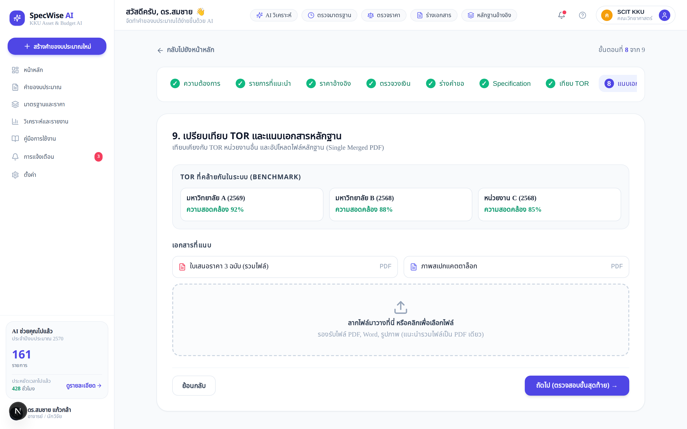

- **ระบบรวมเอกสาร PDF ไฟล์เดียว (Single Merged PDF Pipeline)**: ระบบจะนำแบบฟอร์มคำขอ ใบเสนอราคา 3 ราย และตารางเปรียบเทียบมารวมเป็นไฟล์ PDF ฉบับสมบูรณ์ชุดเดียว
- จัดเก็บบนระบบคลาวด์มาตรฐาน MinIO S3 พร้อมลิงก์เข้ารหัสความปลอดภัย

---

### ขั้นตอนที่ 9: ตรวจสอบความถูกต้องและยืนยันการส่งคำขอ
**URL:** `/requests/new?step=9`

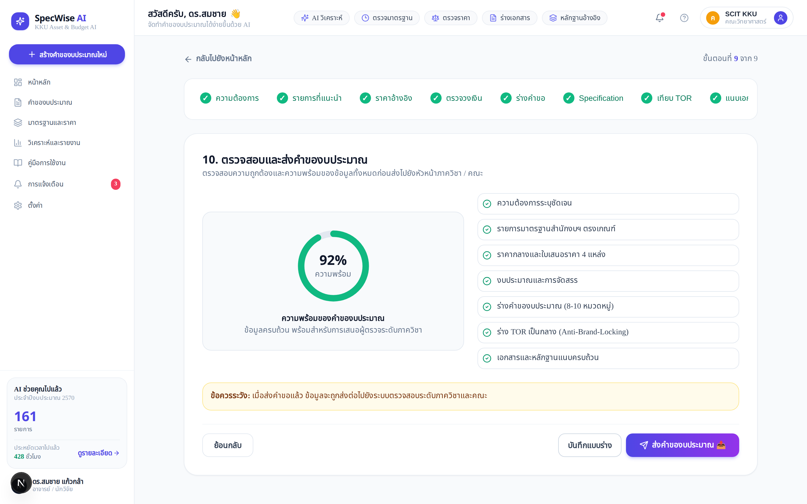

1. ตรวจทานสรุปรายการ วงเงินงบประมาณ และเอกสารแนบทั้งหมด
2. คลิกปุ่ม **"ยืนยันและส่งคำของบประมาณ"**
3. ระบบจะเปลี่ยนสถานะเป็น `SUBMITTED` และส่งการแจ้งเตือนไปยังผู้ตรวจทานระดับภาควิชา/คณะทันที

---

## 5. การติดตามสถานะและการส่งออกเอกสารทางการ

เมื่อส่งคำขอแล้ว สามารถเปิดดูหน้ารายละเอียดคำขอได้ที่ `/requests/[id]` (เช่น `/requests/req-001`)

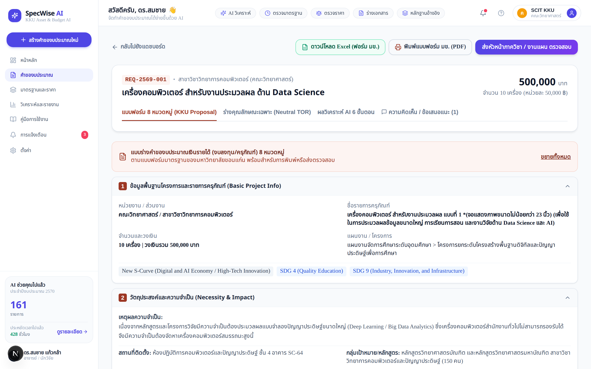

### ฟังก์ชันที่มีในหน้ารายละเอียด:
- **แถบแสดงขั้นตอน Workflow (Stepper Tracker)**: แสดงตำแหน่งปัจจุบันของคำขอ (Draft ➔ Dept Review ➔ Approver ➔ Approved)
- **ปุ่มดาวน์โหลดเอกสาร PDF (Download Official PDF)**: สร้างไฟล์แบบฟอร์มคำขอแบบราชการ มข. พร้อมลายเซ็นและบาร์โค้ดกำกับ
- **ปุ่มส่งออก Excel (Export Excel Summary)**: ส่งออกตารางรายการพัสดุและงบประมาณสำหรับงานแผน
- **กล่องประวัติการตรวจทานและความคิดเห็น (Audit & Comments)**: บันทึกข้อเสนอแนะจากผู้ตรวจทาน

---

## 6. การสืบค้นคลังบัญชีครุภัณฑ์มาตรฐาน

เข้าสู่เมนู **"แคตตาล็อกมาตรฐาน" (Standard Catalogs)** ผ่านเมนูด้านบน `/catalogs`

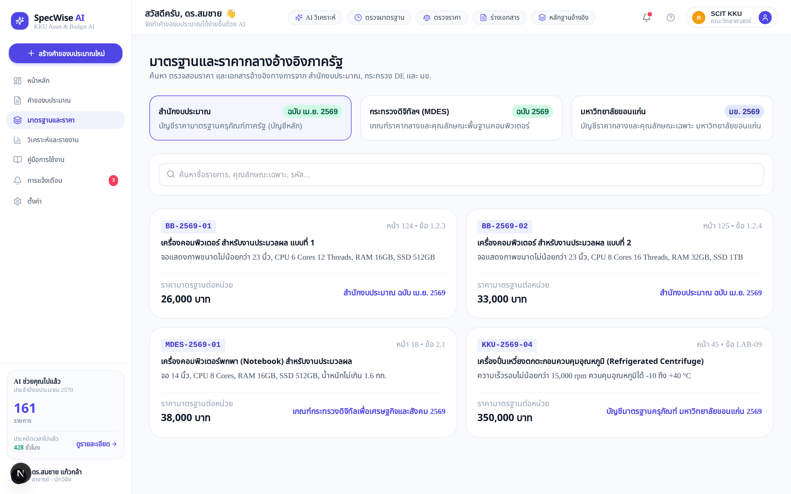

- ค้นหารายการครุภัณฑ์จาก **3 แหล่งมาตรฐานภาครัฐ**:
  1. บัญชีราคามาตรฐานครุภัณฑ์ สำนักงบประมาณ (สงป. 2569)
  2. เกณฑ์ราคากลางและคุณลักษณะพื้นฐาน ICT กระทรวง DE (2569)
  3. บัญชีราคาและครุภัณฑ์เฉพาะของ มหาวิทยาลัยขอนแก่น (มข.)
- แสดงราคากลาง คุณลักษณะขั้นต่ำ เกณฑ์การซ่อมบำรุง และหมวดหมู่งบประมาณ

---

## 7. รายงานสถิติและผลการวิเคราะห์ภาพรวม

เข้าสู่เมนู **"รายงานและสถิติ" (Reports & Analytics)** ผ่านเมนู `/reports`

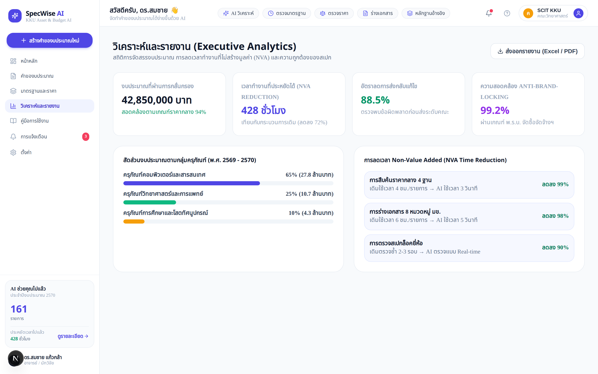

- **สถิติภาพรวมงบประมาณ**: ยอดรวมงบประมาณที่ขอตั้ง, วงเงินที่ผ่านการอนุมัติ, อัตราส่วนความคุ้มค่า
- **ดัชนีชี้วัดความคุ้มค่า (Value-Add Index)**: แสดงสัดส่วนงบประมาณที่ช่วยเพิ่มประสิทธิภาพงานวิจัยและการเรียนการสอน
- **สถิติระยะเวลาดำเนินการ (Cycle Time)**: เวลาเฉลี่ยในการจัดทำและอนุมัติคำขอ

---

## 8. ศูนย์การแจ้งเตือนและการตั้งค่าระบบ

### 8.1 ศูนย์การแจ้งเตือน (Notifications) — `/notifications`
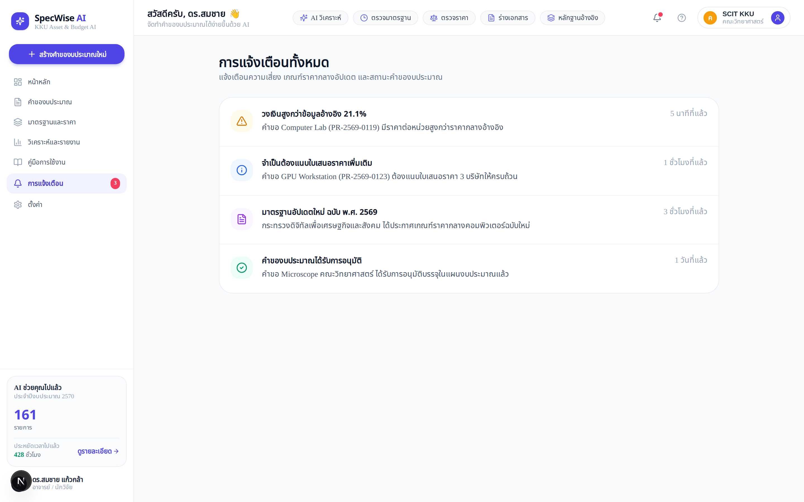
- แจ้งเตือนเมื่อคำขอได้รับการอนุมัติ, มีการขอให้แก้ไข หรือมีการปรับปรุงบัญชีราคามาตรฐานใหม่

### 8.2 การตั้งค่าระบบ (Settings) — `/settings`
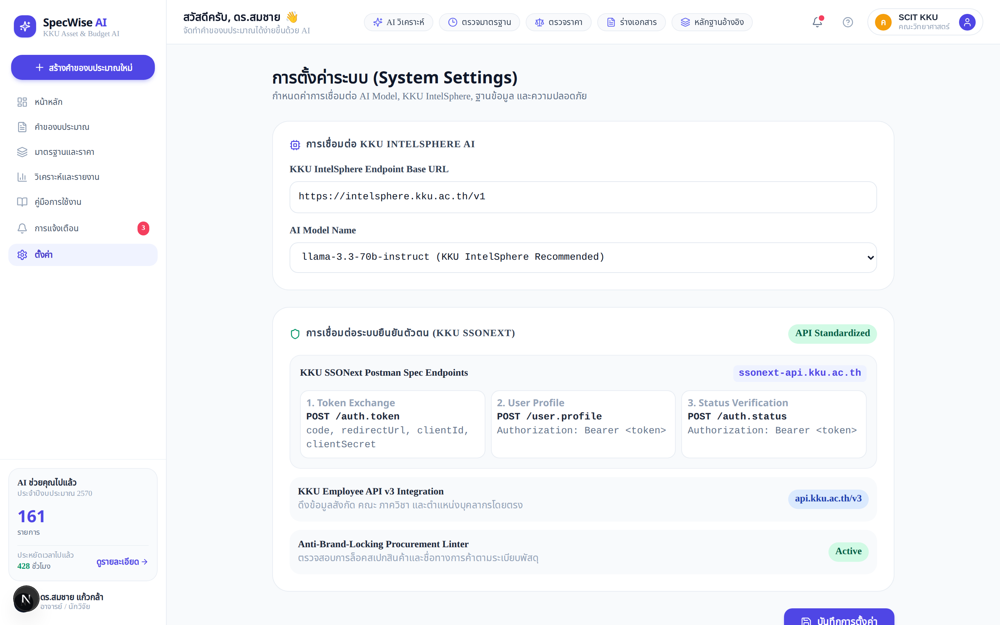
- ปรับแต่งข้อมูลส่วนตัว, ภาษา (ไทย/อังกฤษ), การแจ้งเตือนผ่านอีเมล KKU Mail และโหมดการแสดงผล

---

## 9. คำถามที่พบบ่อยและข้อแนะนำ (FAQ)

### Q1: หากครุภัณฑ์ที่ต้องการไม่มีในบัญชีมาตรฐานสำนักงบประมาณ ต้องทำอย่างไร?
> **คำแนะนำ**: สามารถพิมพ์ความต้องการและระบุให้เป็น "ครุภัณฑ์นอกบัญชีมาตรฐาน" ได้ โดยในขั้นตอนที่ 3 AI จะนำเกณฑ์ราคาตลาดจากใบเสนอราคาอย่างน้อย 3 ราย และสัญญาย้อนหลังมาคำนวณราคากลางอ้างอิงให้ พร้อมร่างหลักการเหตุผลความจำเป็นในขั้นตอนที่ 5

### Q2: ข้อความสเปกที่ AI สร้างขึ้น สามารถแก้ไขเองได้หรือไม่?
> **คำแนะนำ**: ผู้ใช้สามารถแก้ไข เพิ่มเติม หรือลบข้อกำหนดในแต่ละข้อได้โดยตรงในขั้นตอนที่ 5 และ 6 โดยระบบจะตรวจสอบคำต้องห้าม (Brand Name Linter) แบบเรียลไทม์เพื่อไม่ให้มีคำที่เสี่ยงต่อการล็อกสเปก

### Q3: ไฟล์แนบใบเสนอราคาต้องใช้รูปแบบใด?
> **คำแนะนำ**: แนะนำให้อัปโหลดเป็นไฟล์ PDF หรือรูปภาพ (JPG, PNG) ที่มีความคมชัด ระบบจะทำการ OCR และรวมเป็นไฟล์เอกสารประกอบคำขอฉบับสมบูรณ์ให้อัตโนมัติ

---
*จัดทำโดย: ทีมพัฒนานวัตกรรม SpecWise AI • KKU AI Hackathon 2026 • มหาวิทยาลัยขอนแก่น*
